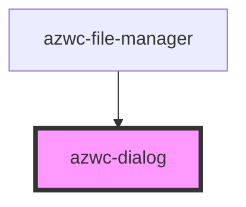

# azwc-dialog

<!-- Auto Generated Below -->

## Events

| Event               | Description | Type               |
| ------------------- | ----------- | ------------------ |
| `customStateChange` |             | `CustomEvent<any>` |

## Shadow Parts

| Part                       | Description |
| -------------------------- | ----------- |
| `"centered-modal-content"` |             |
| `"close"`                  |             |
| `"modal"`                  |             |
| `"modal-content"`          |             |

## Dependencies

### Used by

 - [azwc-file-manager](../azwc-file-manager)

### Graph

----------------------------------------------

*Built with [StencilJS](https://stenciljs.com/)*
