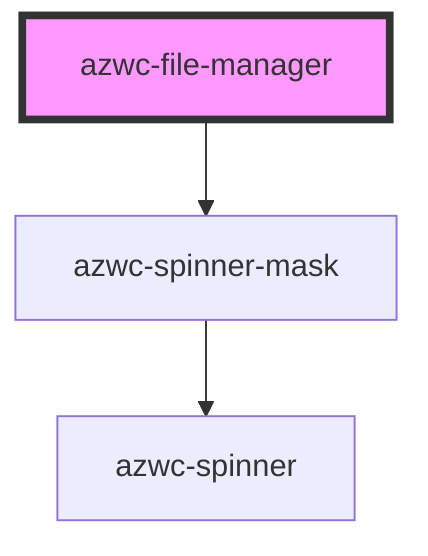

# azwc-file-manager

<!-- Auto Generated Below -->

## Properties

| Property   | Attribute   | Description | Type     | Default |
| ---------- | ----------- | ----------- | -------- | ------- |
| `basePath` | `base-path` |             | `string` | `''`    |

## Methods

### `reload(newPaths?: string[]) => Promise<void>`

#### Returns

Type: `Promise<void>`

### `setApi(fileApi: any) => Promise<void>`

#### Returns

Type: `Promise<void>`

## Dependencies

### Depends on

- [azwc-spinner-mask](../azwc-spinner-mask)

### Graph

----------------------------------------------

*Built with [StencilJS](https://stenciljs.com/)*
