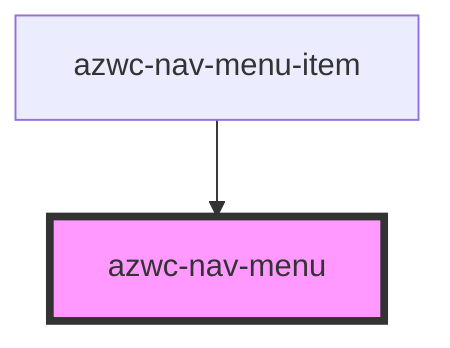

# azwc-nav-menu

<!-- Auto Generated Below -->

## Properties

| Property | Attribute | Description | Type                | Default     |
| -------- | --------- | ----------- | ------------------- | ----------- |
| `showOn` | `show-on` |             | `"" \| "left-side"` | `undefined` |
| `type`   | `type`    |             | `"" \| "left-side"` | `undefined` |

## Dependencies

### Used by

 - [azwc-nav-menu-item](../azwc-nav-menu-item)

### Graph

----------------------------------------------

*Built with [StencilJS](https://stenciljs.com/)*
