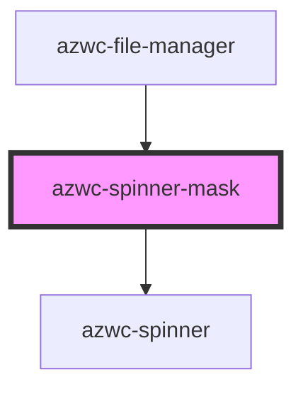

# azwc-spinner-mask

<!-- Auto Generated Below -->

## Properties

| Property      | Attribute      | Description | Type     | Default   |
| ------------- | -------------- | ----------- | -------- | --------- |
| `enabled`     | `enabled`      |             | `string` | `'false'` |
| `size`        | `size`         |             | `string` | `'20px'`  |
| `strokeWidth` | `stroke-width` |             | `string` | `'4px'`   |

## Dependencies

### Used by

 - [azwc-file-manager](../azwc-file-manager)

### Depends on

- [azwc-spinner](../azwc-spinner)

### Graph

----------------------------------------------

*Built with [StencilJS](https://stenciljs.com/)*
