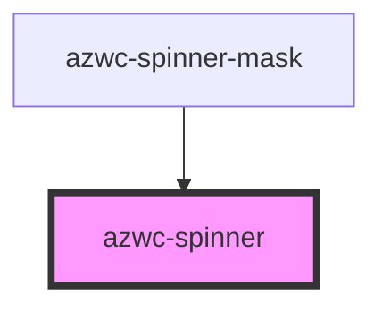

# azwc-spinner

<!-- Auto Generated Below -->

## Properties

| Property        | Attribute        | Description | Type     | Default |
| --------------- | ---------------- | ----------- | -------- | ------- |
| `containerSize` | `container-size` |             | `string` | `''`    |
| `size`          | `size`           |             | `string` | `'1em'` |
| `strokeWidth`   | `stroke-width`   |             | `string` | `'2px'` |

## Shadow Parts

| Part     | Description |
| -------- | ----------- |
| `"base"` |             |

## Dependencies

### Used by

 - [azwc-spinner-mask](../azwc-spinner-mask)

### Graph

----------------------------------------------

*Built with [StencilJS](https://stenciljs.com/)*
